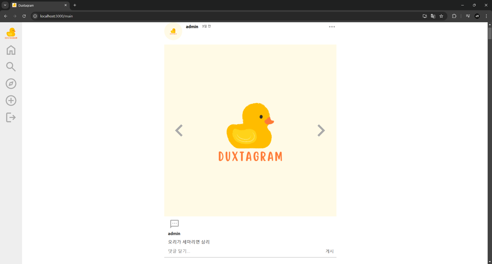
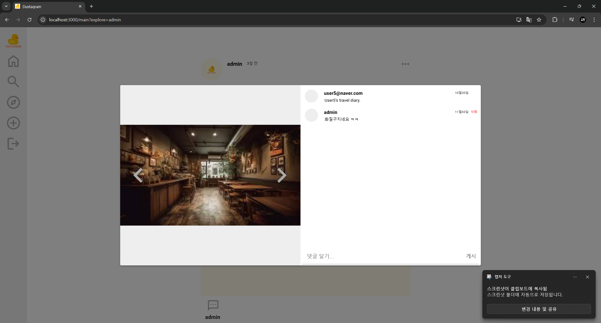
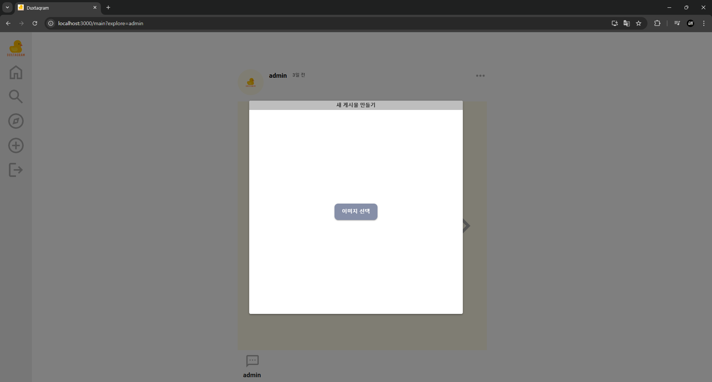
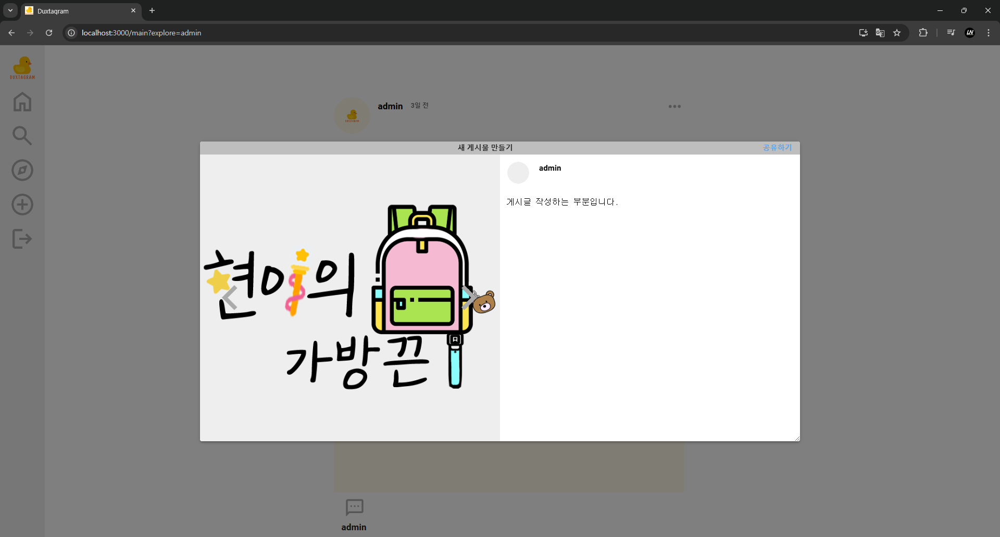
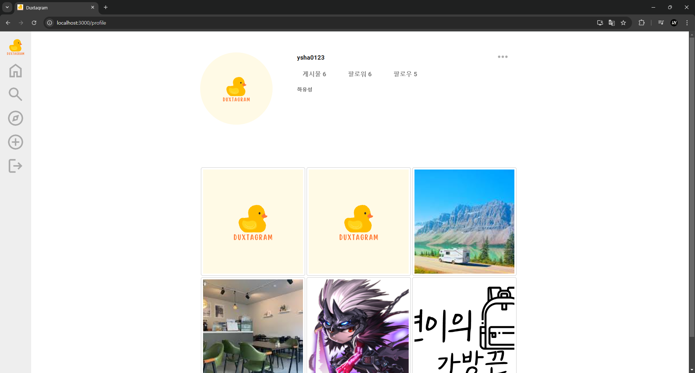
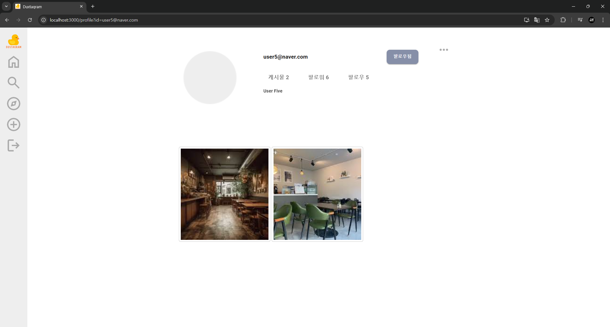

# 📚 프로젝트명: Duxstagram


## 1. 프로젝트 개요

### 프로젝트 요약
이 프로젝트는 학습을 위해 작성된 **인스타그램** 카피 페이지입니다.<br>
**회원가입, 로그인, 프로필 사진** 등의 설정이 가능하며 유저 간 **팔로우**기능을 지원합니다.<br> 사진을 포함한 **게시글 작성**이 가능하고 **댓글** 기능이 있습니다.

### 프로젝트 목표
> JWT의 Access Token 및 Refresh Token을 통한 안전한 인증 구현<br>
Pool - Release를 이용한 DB 관리<br>
Redis CacheServer를 사용한 RefreshToken 관리<br>
React의 구조를 이용한 전체적인 모듈화


### 기술 스택


<!--  -->


- **프론트엔드**: *React*
- **백엔드**: *Node.js, Express*
- **데이터베이스**: *MySQL*
- **캐시서버**: *Redis*

## 2. 기능 설명

### 핵심 기능 목록

- **사용자 관리**: 회원가입, 로그인, 프로필 사진 변경
    - 회원가입 시 **bcrypt**를 통해 hash화된 비밀번호 생성
    - 로그인 시 JWT를 이용해 **RefreshToken** 및 **AccessToken** 생성 관리
    - AccessToken 만료 시 401status를 리턴,<br>
     axiosIntercepter를 이용해 RefreshToken을 검증한 뒤 AccessToken을 재발급한다.
    - **RefreshToken**은 Redis를 이용해 효율적으로 관리된다.
    - multer를 이용해 ServerStorage에 프로필 이미지 저장
- **팔로우**: 사용자 간 팔로우를 통해 피드 리스트 변경
    - 메인 페이지에서 보여주는 리스트는 본인 및 팔로우한 유저의 피드만 보여준다.
- **피드**: 피드, 댓글 작성 및 삭제
    - multer를 이용해 ServerStorage에 피드 이미지 저장


### UI/UX 설명
> **홈 화면**:<br>
 사용자 및 팔로우한 유저의 피드리스트를 보여준다. 댓글을 바로 작성할 수 있고 상세보기 등이 가능하다.



> **피드 디테일**:<br>
 피드의 상세한 정보를 보여준다. 댓글 및 게시글 내용을 표시하고 댓글의 작성이 가능하다.


> **피드 작성**:<br>
 피드를 작성한다. 사진을 먼저 고르고 게시글을 작성한다.



> **프로필**:<br>
 유저의 프로필을 보여준다. 본인의 경우 프로필 이미지 수정, 타인의 경우 팔로우/언팔로우가 가능하다.



## 3. 프로젝트 구조

<!-- ### 폴더 구조
```plaintext
📂 my-project
├── 📂 client         # React 소스 코드 (프론트엔드)
│   ├── 📂 public
│   │   └── 📂 assets # client 기본 이미지
│   └── 📂 src
│   │   └── 📂 assets # client 기본 이미지
└── 📂 server         # Node.js + Express 백엔드
    ├── 📂 config     # 환경 설정 파일
    ├── 📂 controllers
    ├── 📂 models     # MySQL 모델 정의
    └── 📂 routes     # API 라우터
``` -->
### 클라이언트-서버 구조
프론트엔드와 백엔드를 분리하여, React 클라이언트에서 Axios로 데이터를 요청하고, Express API 서버에서 응답합니다. 이를 통해 각 구성 요소가 독립적으로 개발 및 유지 관리될 수 있어 유연성과 확장성을 높였습니다.

- **Redux 사용**<br>
 상태 관리를 위해 Redux를 사용하여, 애플리케이션의 전역 상태를 효율적으로 관리하고, 컴포넌트 간의 데이터 흐름을 단순화했습니다. 이를 통해 사용자 인터페이스의 일관성을 유지하고, 예측 가능한 상태 관리를 가능하게 했습니다.

- **JWT (JSON Web Token)**<br>
 사용자 인증을 위해 JWT를 활용하여, 사용자 로그인 및 세션 관리를 안전하게 처리했습니다. JWT를 통해 클라이언트는 서버와의 통신 시 인증 정보를 포함시켜 보안성을 높였습니다.

- **Redis 캐시 서버**<br>
 Redis를 사용하여 알림 데이터 캐싱 및 실시간 처리 속도를 높였습니다. 이를 통해 데이터베이스의 부하를 줄이고, 사용자에게 빠른 응답 시간을 제공했습니다.

- **비동기 통신**<br>
 Axios를 통해 비동기 통신을 구현하여, 사용자가 페이지를 새로고침하지 않고도 데이터 업데이트를 실시간으로 반영할 수 있도록 하였습니다. 이는 사용자 경험을 향상시키는 데 중요한 역할을 합니다.

- **RESTful API**<br>
 Express를 기반으로 한 RESTful API를 설계하여, 클라이언트와 서버 간의 명확한 인터페이스를 제공합니다. 이를 통해 리소스에 대한 CRUD(Create, Read, Update, Delete) 작업을 효율적으로 수행할 수 있습니다.

## 5. 주요 기술적 문제와 해결 방법
문제 1: 데이터베이스 쿼리 최적화<br>
상황: 대량의 학습 일정 데이터를 불러올 때 로딩 시간이 길어졌습니다.<br>
해결: 인덱스를 추가하고 Redis 캐시를 활용하여 데이터베이스 부하를 줄였습니다.

문제 2: API 통신의 비동기 처리<br>
상황: Axios로 다수의 API 요청을 보낼 때 통신 순서에 따라 비정상적인 데이터가 표시되었습니다.<br>
해결: async/await를 활용해 비동기 처리를 개선하여 데이터 일관성을 유지했습니다.

배운 점 및 개선 사항
배운 점: 성능 최적화의 중요성과 Redis를 사용한 데이터 캐싱 방법을 깊이 이해하게 되었습니다.
향후 개선: 현재 사용자의 학습 패턴을 분석해 맞춤형 추천 시스템을 추가할 계획입니다.

## 4. 설치 및 실행 방법
로컬 환경 설정
저장소 클론
```js
git clone https://github.com/username/my-project.git
cd my-project
```
필수 환경 설정
프로젝트 루트에 .env 파일을 생성하고, 다음과 같이 환경 변수를 설정하세요:

plaintext
코드 복사
DB_HOST=localhost
DB_USER=root
DB_PASS=password
REDIS_HOST=localhost
MySQL DB 설정
my_project.sql 파일을 통해 데이터베이스 및 테이블을 생성합니다.

의존성 설치
클라이언트:
```js
cd client
npm install
npm start
```
서버:
```js
cd server
npm install
npm node app
```